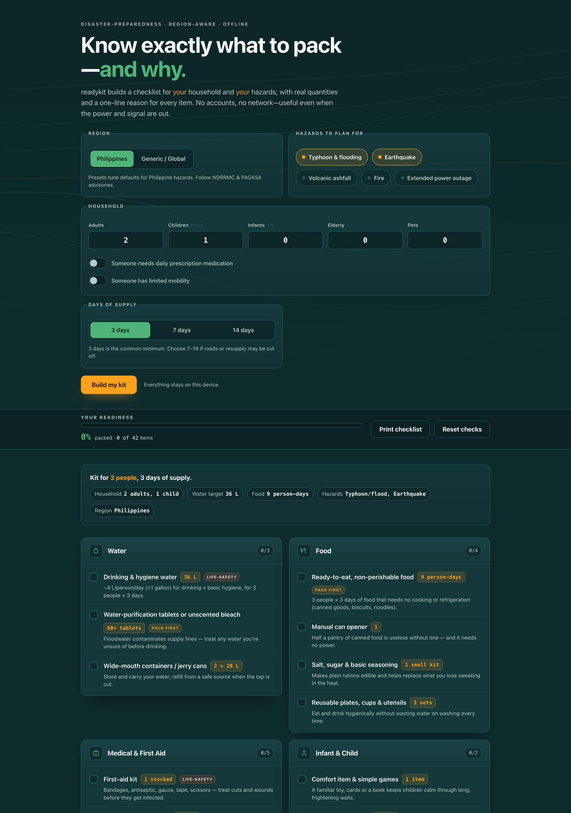

# readykit

**Know exactly what to pack — and why.** A region-aware disaster-preparedness checklist generator that tailors an emergency kit to *your* household and *your* hazards, with real quantities and a one-line reason for every item. 100% client-side, zero dependencies, works fully offline.

## Why

Most "emergency kit" lists you find online are generic and US-centric — heavy on tornado and blizzard advice, vague on amounts ("store some water"). That doesn't help a family in Metro Manila deciding what to actually buy before typhoon season.

readykit is different: it takes your **region**, the **hazards** you face, your **household** (adults, children, infants, elderly, pets, plus medication and mobility needs), and how many **days** of supply you want — then computes a prioritized, categorized checklist with concrete quantities and the reasoning behind each one. You see the math, so you can trust it and adjust it.

## Features

- **Region + hazard aware** — Philippines and Generic/Global presets; toggle typhoon/flooding, earthquake, volcanic ashfall, fire, and extended power outage. Items change with your hazards (e.g. N95 masks and goggles appear only for volcanic ashfall).
- **Real quantity math** — water at ~4 L/person/day, food in person-days, diapers at ~6/day, pet food in pet-days — all computed from your household × days and shown in the "why".
- **A reason for every item** — plain-language explanation of why it matters, so nothing is cargo-cult packing.
- **Readiness meter** — check items off and watch a calm-green meter fill to show how ready you are; per-category counts too.
- **Printable** — a clean, black-and-white print layout with a household summary header, for a copy on the fridge or in the go-bag.
- **100% offline** — no accounts, no network calls, no tracking. Your inputs never leave your device.

## Quickstart

Just open `index.html` in any modern browser — no build step, no server, no install.

- **Local:** double-click `index.html`, or run a static server in the folder.
- **Hosted:** **[Open readykit live](https://sreenivas-sadhu-prabhakara.github.io/readykit/)**

Your checkmarks are saved in your browser's local storage, keyed to your exact configuration, so they persist between visits.

## Privacy

readykit is built to be trustworthy when it matters most — when the power and signal are out.

- A strict Content-Security-Policy sets `connect-src 'none'`: the app **cannot** make any network request even if it tried.
- No external fonts, scripts, images, or analytics. Everything is self-contained.
- All logic runs in your browser. Nothing about your household is ever transmitted or stored anywhere but your own device.
- Because there are no network dependencies, it works with **no signal at all** — download it once and it keeps working offline.

## Disclaimer

readykit provides general preparedness information for educational purposes only. It is not professional emergency-management, medical, engineering, or safety advice. Quantities and suggestions are general guidelines and may not fit your specific situation — always follow the instructions of your local civil-defense and disaster authorities (in the Philippines: NDRRMC and PAGASA). This software is provided under the MIT License, "as is", without warranty of any kind; the authors accept no liability for any loss, injury, or damage arising from its use.

## License

[MIT](./LICENSE) © 2026 Sreenivas Sadhu Prabhakara
